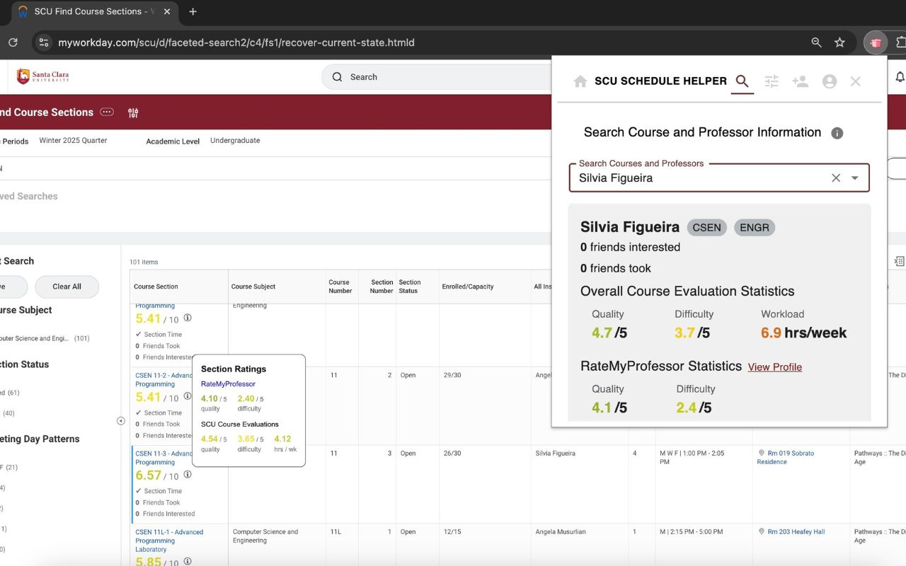
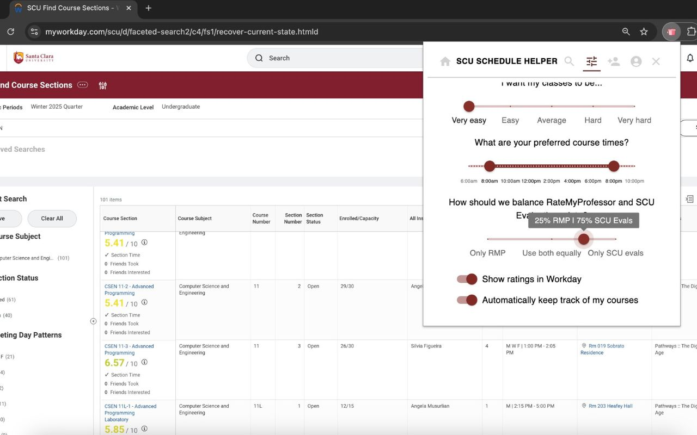
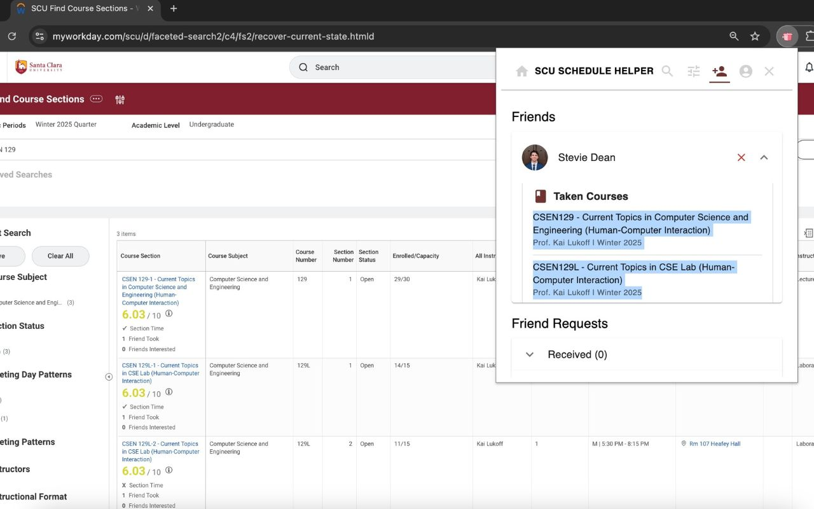

# SCU Schedule Helper

Course/professor rating to help with SCU schedule planning.

Easily view professor and course ratings through additions to the course registration website, as well as a custom searching tool. Consider these rankings with the courses your friends have taken, or are interested in.

## Demo (click)

## Screenshots
 \
 \

## Development

### General Notes
1. We are primarily using Node.js version 22.x for development. Please install it if you don't already have it.
    * Before running any code, use npm i to install the dependencies.
2. For consistent code formatting, Prettier is recommended. There is a Prettier VSCode extension which integrates nicely with development.
3. You may notice certain naming patterns and conventions (e.g. main file is usually called index.js, file directories in snake case, etc). Please try to conform to these.

### Access Control (mostly for backend)

You may need access to certain things depending on the feature you're working on:

1. For backend development on any of the existing AWS Lambda functions, you will need various environment variables (API keys, credentials, etc) in order to run your code.
2. In order to deploy your code, you will need access to the AWS console.
3. Depending on the feature, you may also need to access the Google Cloud Project for SCU Schedule Helper.

To request access to any of these, please email stephenwdean@gmail.com or mattyherzig@gmail.com
