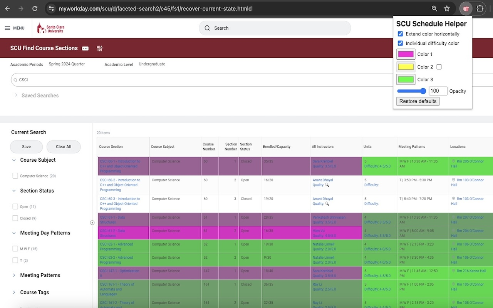

# SCU-Schedule-Helper

For now, we only get rating data from Rate My Professors. However, we are planning on integrating official Santa Clara University evaluations from https://evaluations.scu.edu/ (specifically, we’re teaming up with Zach Bellay who made https://www.scu-course-evals.com/).

## Demo (click)

## Screenshots
   
